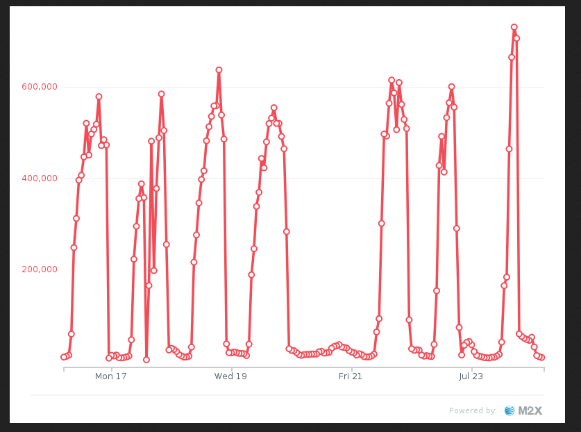
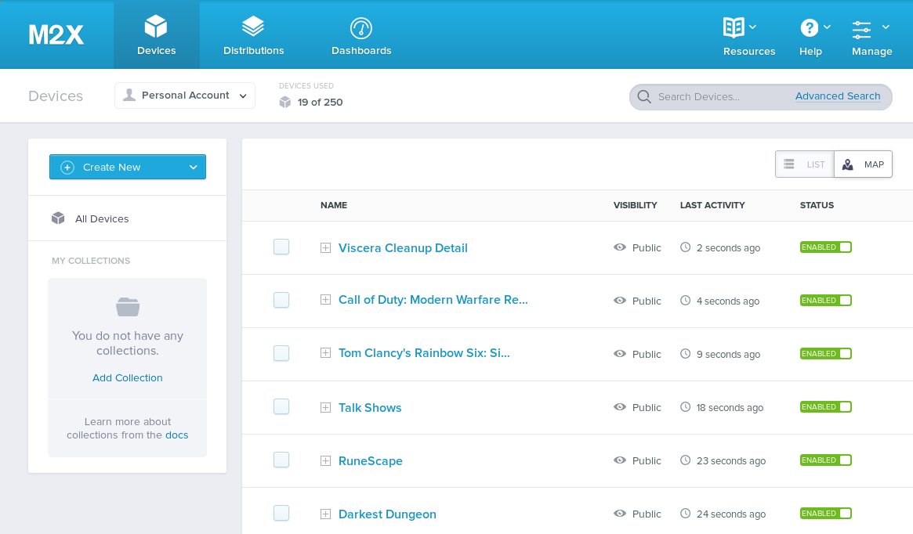
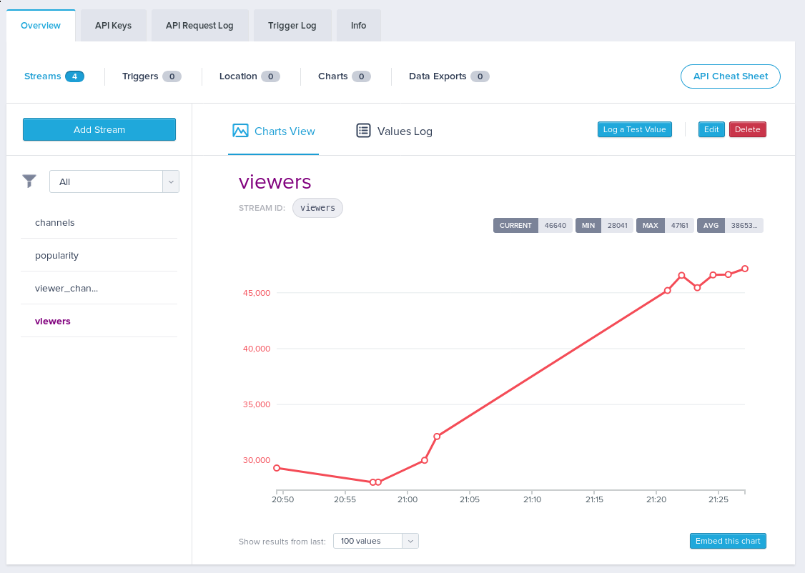
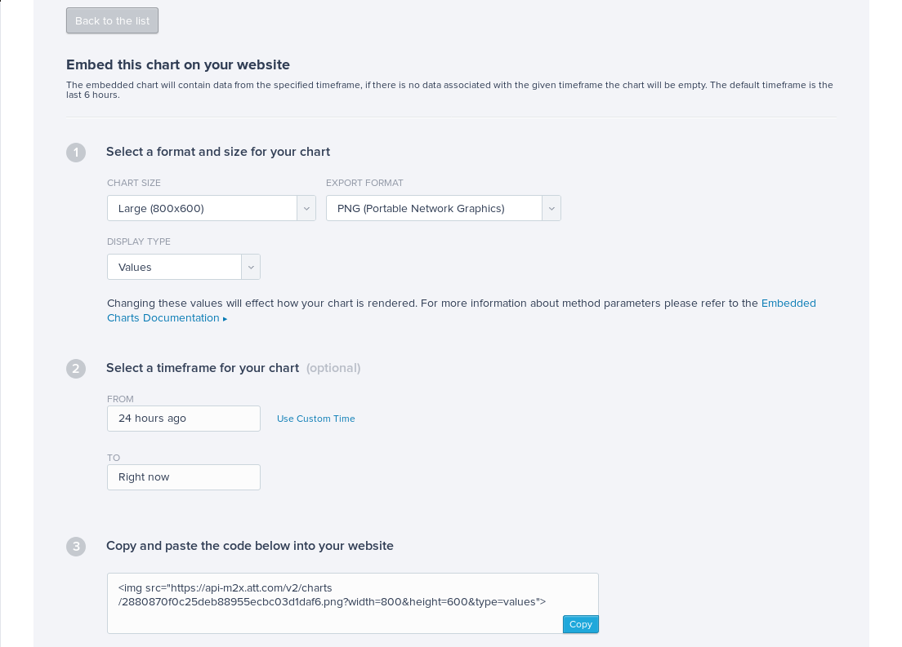
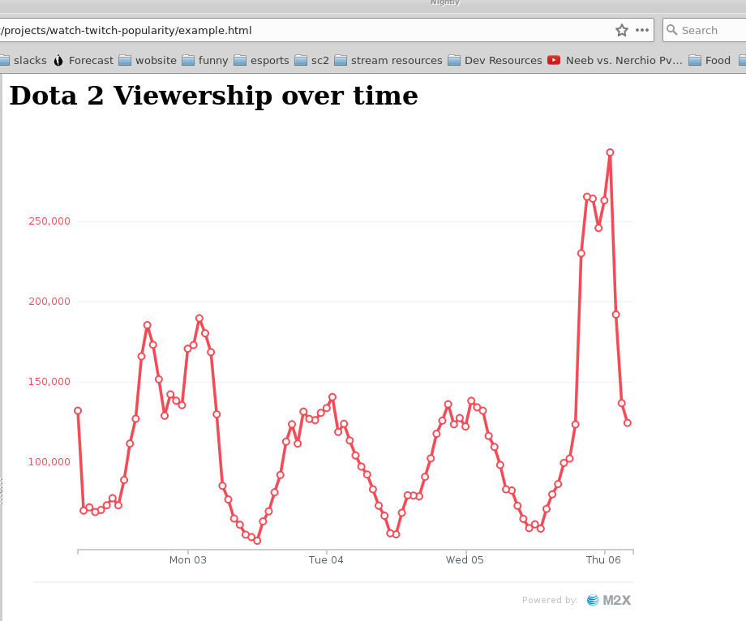

Twitch Viewers during the CSGO Major
====================================





Viewers over time for csgo during the major. The peak value is 779k concurent viewers. (This is all csgo channels, not just the major).


Track Twitch Popularity
=======================


Twitch.tv is largest streaming website in the world. Thousands of streamers stream for hours each day for upwards of a million viewers.

Streams are grouped by game, and we can see the relative popularity of each stream at the directory page: https://twitch.tv/directory.

This is an example "application" that pulls that data from the api and stores it in a time series database. IBM Bluemix offers ATT M2X time series and we will be using that.


Getting Started
---------------


Find the service in the catalog


Provision the instance. Note that we'll want at least the 50 device plan. If you want to use the 10 device plan, you can change the scripts to only track the top 10 games.


Locate your m2x master key at [the account settings page](https://m2x.att.com/account)


Get a twitch token

TODO: Add docs on twitch token

Create a configuration file. Add both the twitch token and the master key to the config file. Delay can be decreased. Set max_devices to the number of devices you selected in your m2x plan.

```bash

cp example_config.py config.py
vim config.py
```


Install requirements

```bash
virtualenv --python=python3 venv 
source venv/bin/activate
pip install -r requirements.txt`
```


Run the script locally
----------------------

Start by running the script


```bash
python track_twitch_popularity.py
```

Note this takes a while because of some naive sleeps to avoid api rate limits.


Graphs!
-------


There are now data sets in your m2x dashboard as devices





Run the script a few more times, possibly in a loop. You'll have time series data. This is Dota 2 viewership over a small time interval.





Use embeded graphs
------------------


M2X can publish graphs as svg or png resources, that can then be embeded into web pages.

Configure the graph.



Example of embeded graph. See example.html in this repository



