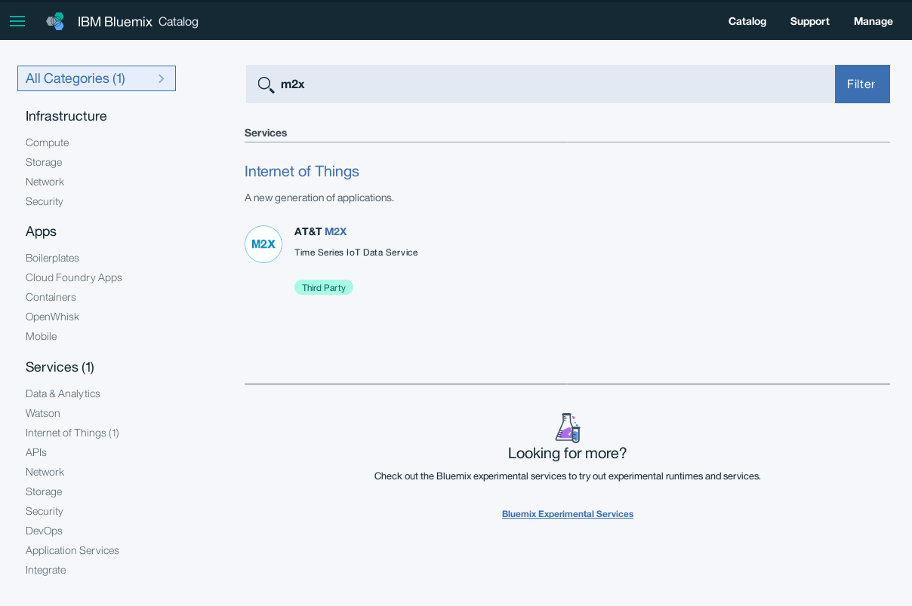
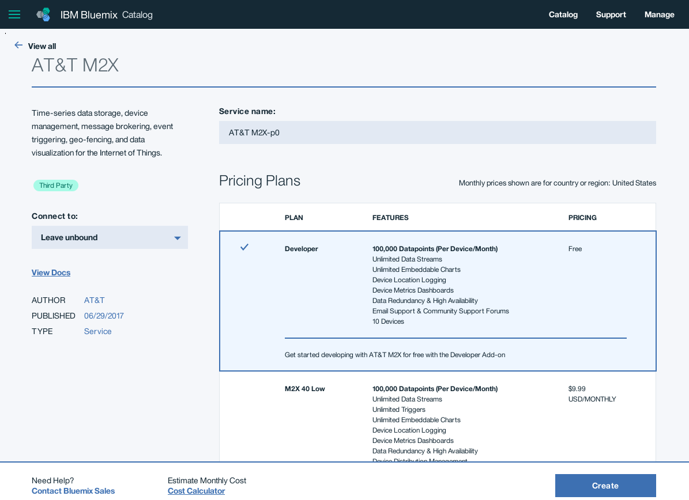
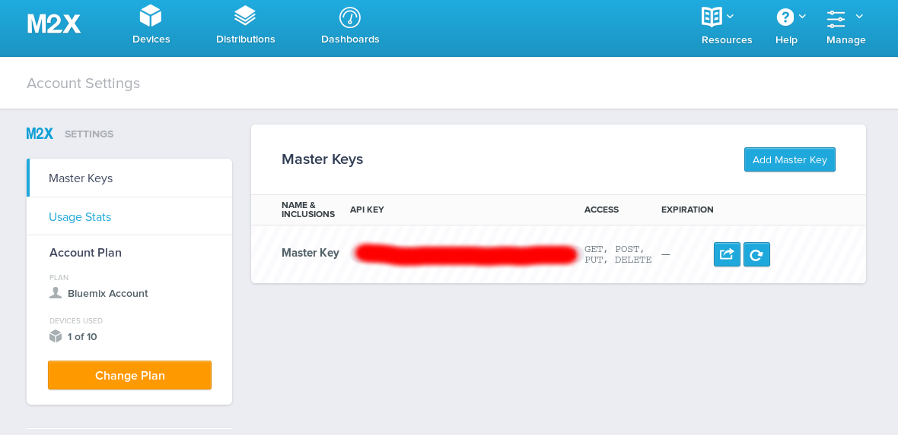

Track Twitch Popularity
=======================

Twitch.tv is largest streaming website in the world. Thousands of streamers stream for hours each day for upwards of a million viewers.

Streams are grouped by game, and we can see the relative popularity of each stream at the directory page: https://twitch.tv/directory.

This is an example "application" that pulls that data from the api and stores it in a time series database. IBM Bluemix offers ATT M2X time series and we will be using that.

Getting Started
---------------

Find the service in the catalog

Provision the instance

Locate your m2x master key at [the account settings page](https://m2x.att.com/account)

